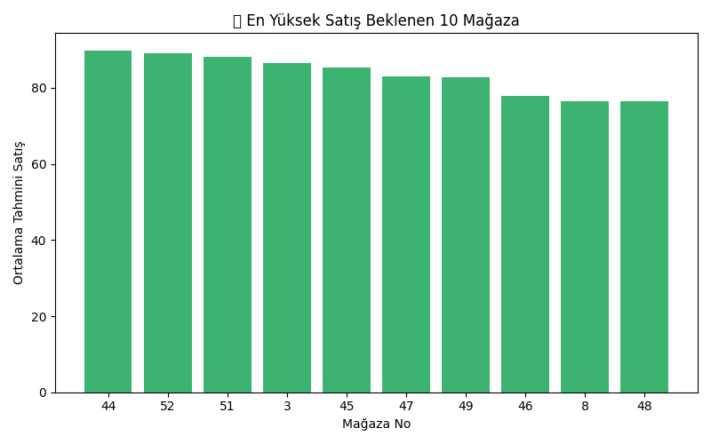
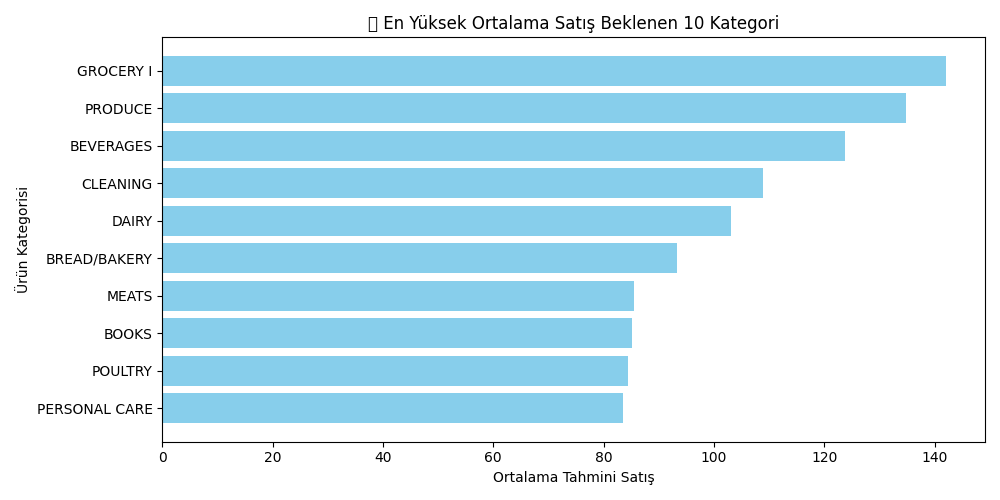
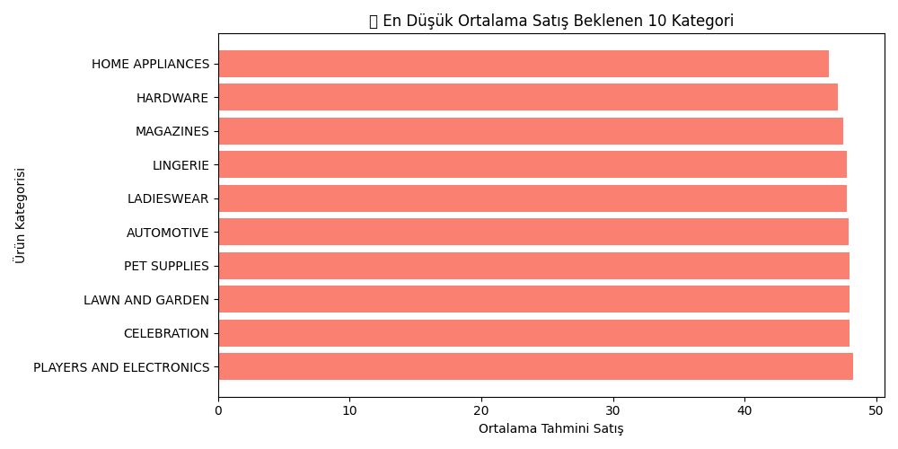

# Demand Forecasting Project

This project predicts daily product demand at the store level using machine learning.  
It helps identify which stores and product categories are expected to sell more or less in the next period.

---

## Goal

The main goal is to build a forecasting model that predicts future sales using historical data and external factors such as store information, promotions, oil prices, and holidays.

---

## Dataset

- Over 3 million rows of daily sales data  
- 54 stores and 33 product categories  
- Features include: `store_nbr`, `family`, `onpromotion`, `date`, `oil price`, `holiday flag`, lag features, and rolling averages.  

> Note: Large raw files (over 100MB) are not included due to GitHub size limits.  
> All scripts are available in the `/src` folder.

---

## Project Structure

demand_forecast_project/
│
├── data/ # Raw input data (ignored in repo)
├── outputs/ # Model outputs and reports
├── src/ # Python source code
│ ├── feature_engineering.py
│ ├── model_training.py
│ ├── model_tuning.py
│ ├── model_summary.py
│ ├── forecast_generation.py
│ ├── forecast_analysis.py
│ └── forecast_viz.py
└── README.md

---

## Model Training

- Algorithm: LightGBM Regressor  
- Hyperparameter tuning with `GridSearchCV`  
- Evaluation metrics: RMSE, MAPE, R²  

**Best Model Results:**
- MAPE: ~17%  
- R²: 0.83  

---

## Results

### Top Performing Categories
| Category | Avg Predicted Sales |
|-----------|--------------------|
| GROCERY I | 142.0 |
| PRODUCE | 134.7 |
| BEVERAGES | 123.7 |
| CLEANING | 108.8 |
| DAIRY | 103.0 |

### Lowest Performing Categories
| Category | Avg Predicted Sales |
|-----------|--------------------|
| LADIESWEAR | 47.7 |
| LINGERIE | 47.7 |
| MAGAZINES | 47.5 |
| HARDWARE | 47.1 |
| HOME APPLIANCES | 46.4 |

---

## Visualizations

The following visualizations summarize forecast insights:

---

## Power BI Dashboard

A Power BI dashboard (`Demand_Forecast_Dashboard.pbix`) was created to visualize store-level accuracy, forecast vs. actual comparison, and product category performance.

---

## Key Insights

- The model predicts around **83% of store-level demand** correctly.  
- Grocery and Produce categories dominate total sales.  
- Categories such as Magazines and Hardware show lower demand.  
- These forecasts help optimize inventory and marketing strategies.

---

## Future Improvements

- Test advanced models like **LSTM**, **Prophet**, and **XGBoost**.  
- Add **weather** and **macroeconomic** indicators.  
- Automate **weekly forecast updates** for continuous improvement.